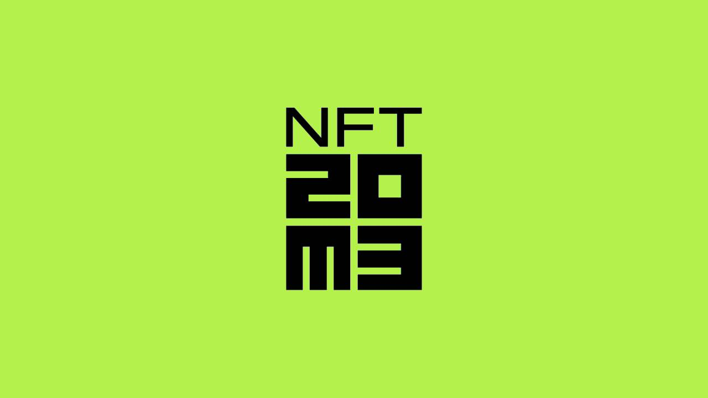

# NFTRome 2023 - Hackaton




## Techincal organization of the hackaton

• Participants of the hackathon will be divided into teams with heterogeneous skills, with a maximum of 5 participants per team.

• It would be advisable to limit the number of teams to a maximum of 5 so that projects can be evaluated within the specified time.

• The teams will have from 06-05-2023 to 13-05-2023 to complete the project.

## Deliver the project

Participants must fork this GitHub repository and create a pull request by adding a folder like `TEAMNAME_PROJECTNAME`. This will allow us to check the repositories and independently verify the functionality of the project.

The folder must contain a `README.md` that explains the project and the team and two subfolders `presentation` and `codebase`. Folder should be something like:
```
TEAMNAME_PROJECTNAME
|
| - - codebase
| - - documentation
| README.md

```

Candidates should document their projects appropriately by providing

• Documentation for the configuration and execution of the project. A README.md file that includes all the necessary steps and dependencies to install in order to run the project.

• Functional documentation that describes the application's operation.
• Project description.

• Other documentation if necessary to better understand the project.

## Main topic of the hackaton

The objective of the hackathon will be focused on the implementation of the ERC-4337 standard. It will be important for participants to understand the purpose and functionality of the standard and implement its core features.

## Documentation to study before starting development

We hope you already heard about account abstraction and ERC-4337, if not we're leaving there some links.

https://blog.openzeppelin.com/eip-4337-ethereum-account-abstraction-incremental-audit/

https://eips.ethereum.org/EIPS/eip-4337

https://ethereum.stackexchange.com/questions/146974/how-to-start-with-erc-4337

## Ideas for implementations

• Sponsored transactions: Allow users to interact with smart contracts without directly paying gas fees in Ether. Instead, an intermediary (usually called a "relayer") pays the fees and can be reimbursed in another token or receive compensation in other forms.

• Create a new or use an existing dApp that integrates the ERC-4337 standard to facilitate user interaction with smart contracts.

• Explore new business models that leverage sponsored transactions to generate revenue or promote blockchain adoption.

• Develop tools and services that simplify the implementation and integration of the ERC-4337 standard for developers and companies.

• Delegated execution: Users could delegate the execution of certain actions to third parties, such as relayers, without sharing their private keys. This could be useful for automating some operations or allowing new users to interact with the blockchain without managing private keys.

• Gasless Voting: In blockchain-based governance systems, the ERC-4337 standard could be used to allow users to vote without paying gas fees. Instead, the fees could be covered by the project itself or by relayers, incentivizing greater participation.

• Simplified onboarding: The use of sponsored transactions could facilitate the introduction of new users to blockchain applications, eliminating the need to own Ether to cover gas fees. This could improve the adoption of blockchain and dApps by less experienced users.

• Micropayments: The ERC-4337 standard could be used to implement micropayment solutions that allow users to make small transactions without incurring high fees. Relayers could aggregate several transactions into a single transaction to reduce overall gas costs.

• Cross-chain interoperability: ERC-4337 could be used as a basis to develop solutions that allow sponsored transactions between different blockchains, facilitating interoperability between different ecosystems and blockchains.


These are just some of the possible implementations. Candidates will be free to develop the implementation they deem most appropriate and will not be bound in any way to the above-mentioned implementations.

These are just some of the possible implementations, candidates will be free to develop the implementation they deem most appropriate and will not be bound in any way to the aforementioned implementations, these are just starting points. 

## Evaluation criteria

Innovation: how original and creative the project is in its approach.

Alignment with the objective: how well the project aligns with the specific objective of the hackathon, such as the integration of the ERC-4337 standard and improving the user experience in blockchain applications.

Technical feasibility: whether the project is technically feasible and scalable in a real-world context.

Code quality: the code must be well-organized, easily understandable, and appropriately documented. It should also follow development best practices and security guidelines for smart contracts.

Business impact: assessing the potential impact on the market and the blockchain ecosystem.

Project presentation (optional): if project presentations are planned, it will be important to include them in the evaluation schedule.

Collaboration and teamwork: teams with diverse skills must be able to leverage the skills of each team member and demonstrate effective collaboration, communication, and responsibility distribution.

Each criterion will receive a score from 1 to 10, and the sum of these scores will be the final evaluation that determines the winner.

A public list will be attached here at the end of the evaulation process. For any live update please follow our dedicated [Discord](https://discord.gg/ZUNKAwjPa6) channel.